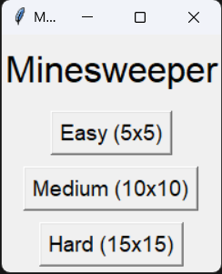
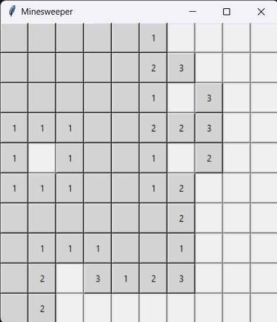
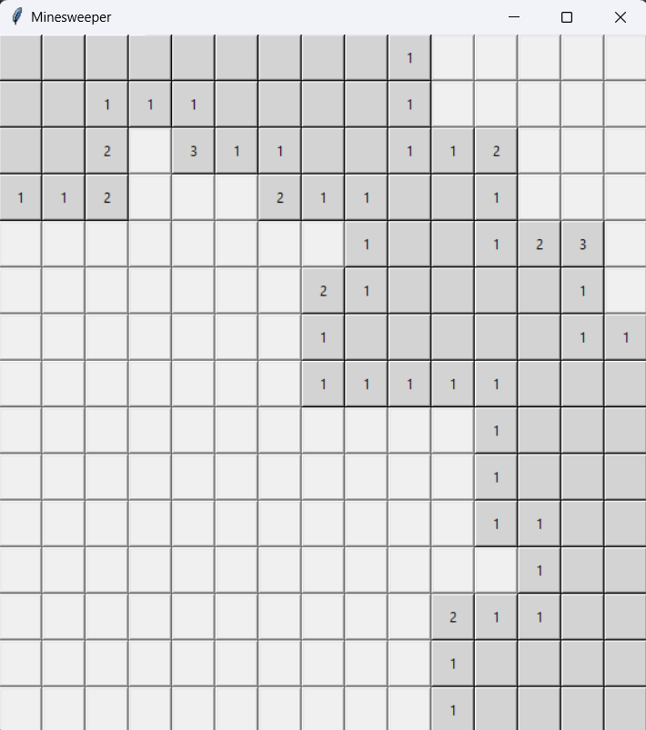
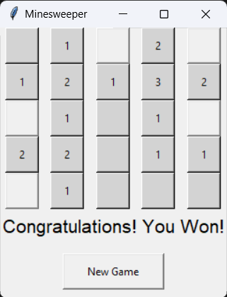
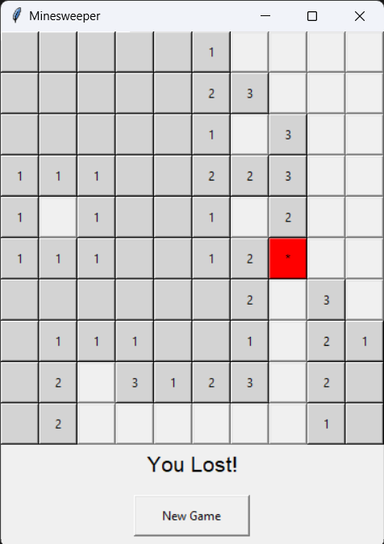

Simple Python Project

# 🕵️‍♂️ Minesweeper - Python  
Minesweeper sederhana yang dibuat dengan Python! 🚀  

## 🎮 Cara Bermain  
1. Jalankan program menggunakan Python.  
2. Pilih Tingkat Kesulitan.  
3. Hindari bom dan selesaikan permainan!

## 📸 Screenshot
1. Landing Page  
  
2. Easy  
  
3. Medium  
  
4. Hard  
  
5. Win  
  
6. Lose  
  

## 🛠 Instalasi  
Pastikan Python sudah terinstall di komputer kamu.  
```sh
git clone https://github.com/Widyasmaraafif/SimplePython.git
cd SimplePython
python minesweeper.py
